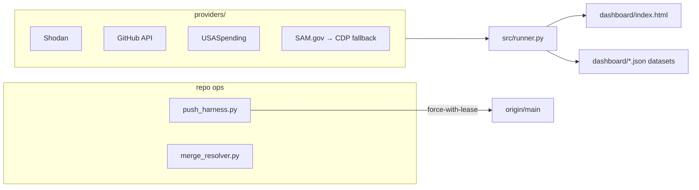

<div align="right">


</div>

# k3-capacity-hack
### Internal capacity analysis and provider integration toolkit — OSINT pipelines, contract intelligence, and a live dashboard.

`k3-capacity-hack` wires external data providers (Shodan, GitHub, USASpending, SAM.gov) into scraping and analysis pipelines, serves the results on a live dashboard, and ships a hardened push harness for operating the repo itself from sandboxed agents. Pure stdlib — zero external Python dependencies for the core.

## Why this exists

Capacity analysis means pulling the same question across many providers that all fail differently: rate limits, geo-blocks, dead APIs, burned credits. This repo is the toolkit that survived those failures — with the failure modes documented in `system_analysis.json` so the next run doesn't pay tuition twice.

## What it does

- **`providers/`** — provider integrations: `shodan_provider.py`, `github_provider.py`, `usaspending_provider.py` (stdlib only).
- **`dashboard/`** — live monitoring dashboard (`index.html`) backed by JSON datasets: Shodan sweeps, GitHub results, SAM.gov recompetes, USASpending contracts.
- **`src/runner.py`** — core pipeline runner.
- **`push_harness.py`** — safe push workflow: detects upstream drift, merges without clobbering, aborts on conflicts, uses `--force-with-lease`.
- **`merge_resolver.py`** — upstream merge resolution without clobbering local work.
- **`system_analysis.json`** — the honest ledger: 10 invariants, 10 observed failures, scored by domain (git workflow, data scraping, visualization, security/OSINT, infrastructure).

## Provider status

| Provider | Status | Credits | Strategy |
|---|---|---|---|
| Shodan | Active | 6/100 | `count()` validation + facet scraping |
| GitHub API | Active | free tier | search + raw code |
| USASpending | Active | free | POST API — 486 contracts retrieved cleanly |
| SAM.gov | Dead | n/a | API down, CDP fallback |
| Grants.gov | Blocked | n/a | geo-blocked (CloudFront 403 on sandbox IP) |
| Exa | Unknown | unknown | fallback search |

Hard-won findings from `system_analysis.json` (2026-08-10):

- **Shodan credits burn fast on noise** — 26/32 spent, mostly Comcast/ComfyUI spam. Validate with `count()` before faceting.
- **USASpending is the reliable one** — open API, no auth, 486 contracts retrieved without a fight.
- **Grants.gov is geo-blocked** — CloudFront 403 from sandbox IPs; don't retry, route around.
- **Git transport to github.com is flaky from sandboxes** — TLS failures; the harness falls back to the Contents API.
- **The IPython kernel dies on >30 s silent commands** — keep exec quiet windows short or heartbeat.



## Quick start

```bash
pip install -r requirements.txt   # stdlib-only core; providers add their own as needed
python3 src/runner.py              # run the pipeline
open dashboard/index.html          # view results
```

## Push workflow

```bash
# With a PAT from the environment (never hardcoded, never committed)
GITHUB_PAT="$GITHUB_PAT" python3 push_harness.py

# If upstream has changes (merge without clobber)
python3 merge_resolver.py
```

- `push_harness.py` detects whether `origin/main` has diverged.
- Local is ancestor → merges upstream into local, then pushes.
- Divergent → merges with `--no-edit`, aborts on conflicts.
- Uses `--force-with-lease` so upstream commits are never clobbered.
- Single trunk: local `main` ↔ `origin/main`, no feature branches.

## Documented endpoints

| Service | Endpoint |
|---|---|
| Kernel (IPython exec) | `http://127.0.0.1:8888` |
| VNC | `http://127.0.0.1:6080` |
| CDP (fallback scraping) | `http://127.0.0.1:9223` |
| K3 proxy | `http://127.0.0.1:19999` |

## Security

- Provider keys and PATs come from the environment or the filesystem secrets store — never committed. API keys appearing in `system_analysis.json` are redacted (`<..._REDACTED>` markers).
- The push harness never force-pushes without a lease.

## Dev

- `requirements.txt` — core is pure stdlib; add provider libs here only if a provider needs them.
- `.github/workflows/` — CI automation.

## License

No `LICENSE` file ships with this repo — all rights reserved unless a license is added.
